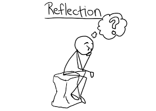

## **Learning the Fundamentals**

Throughout this course, many different software engineering concepts were introduced to us. Every single concept has had its use and has shown us that it can be useful in its own individual ways. When you think about a concept, you think of how it can be used toward something. In this case, the concepts we used can be used in our web applications, but they are more than just tools for web development. These are the fundamentals that every software engineer should be used towards their projects to make them better contributors. 

You must be wondering, what are software engineering concepts? An easy example would be something such as 'Coding Standards'. Coding standards are there to help the readability and quality of your code. It includes things such as formatting, commenting, and things such as organization. These concepts are made to make everyones life easier while also improving our individual skills as well.

## **Making My Code Famous**

Before we created our final projects, we learned about open-source software development. Open source software development is where the code is made public, allowing multiple people to access or edit the code (depending on the sharing preferences). Imagine having a Google document where everyone can edit it at the same time. This allows for easier collaboration within groups so everyone can work on their own individual part without messing with another person's part. If multiple people can get things done at the same time, then the project will finish faster and have greater quality. Having open-source software also means that it is a lot easier for others to check your code if you are having issues. I feel that one of the biggest problems is when somebody gets stuck in a specific area. Having the code open allows others to easily check your work. This is not necessarily just for web development, as this could be used for anything. Even something such as writing an essay could be public, where others can edit and make suggestions on how to improve.

## **Behind the Scenes**

The concepts learned in this class are here to make our lives easier. Some of these concepts are hard to be seen from the outsider's point of view. Configuration management is one of those concepts you will not ever hear about due to it being used in a majority of software projects. Configuration management is controlling the changes made to the components of a system. An example would be making sure you have the correct version of an application. When you play a game, it needs to be updated to the newest version before you can load it up. The same can be said for certain applications and programs, so managing the components in a system is important. This is every software project, not just web development projects. A concept such as this one is very important to make sure everything runs smoothly. 

## **Looking in the Mirror**

As this class comes to a close, I look back and see that everything was building towards our final project. Within our project, we would combine all of the concepts to see if we understood software engineering. Software engineering concepts are to be used in any project possible, whether it is web development based or not. 
