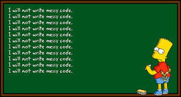

## **Since when did rules exist?**

Coding has been something that every computer science major has done, whether it be through homework, classwork, etc. When using an IDE such as Eclipse, the IDE tells you when there is a syntax error, a type mismatch, or any other small inconvenience that can stop your program from working. These may have been considered rules but not necessarily standards for coding. Coding standards are there to improve the quality and understanding of your code. Usually using a third-party source, code standards can help you see your code in a brand new light.

Following the coding standards results in clean and organized code. Imagine somebody reading a triple-nested for-loop without having indentation. It would be a complete mess, and the reader would not be able to understand what the program may do. Whether it is an employer or teammate, having clean code can really help speed up the process and allow both sides to understand what the program is doing. As you have always heard, "teamwork makes the dream work". 

Using Intellij, we were required to install something called ESLint. ESLint is a program that checks your code to make sure it follows the required standards. It will force you to fix the errors as they can be seen as a warning. I feel that ESLint is very helpful, however, when I am in the process of writing code it can be seen as very annoying. The amount of red squiggly marks I see while trying to create a function bothers me, forcing me to try and fix all the errors while writing the main contents of the function. When it gives me an error of not creating a new line at the end of the file, it causes annoyance and pain as I search through to see where one small red squiggly line is. 

On the flip side, ESLint is very helpful with various things. An example would be that it tells you how you should label your variables based on how you use them. It may tell you to use 'let' or 'const' depending on the use which is very beneficial. It also stops you from creating useless variables. If there is a variable not being used, ESLint will highlight and say the variable is deemed useless. During a test such as a WOD, ESLint can easily pinpoint the area where my code is having a problem. Whether it be a missing bracket, semi-colon, or brace, ESLint will identify if any of the syntax provided is wrong. 

## **Green Lights**

In the end, ESLint is a tool that has its ups and downs. As I have only worked with it for a week, it may be too early to tell whether its positives outweigh the negatives. I do think that there is more upside than downside, but it is all up to the user preference. At least I know my code will be formatted correctly and I get a bright green checkmark showing that ESLint has checked through it with no errors. Throughout the semester, I will get used to using ESLint and hopefully, it will help me become a greater software engineer.

