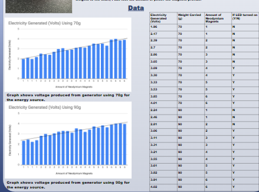

In my senior year of high school, we were required to do a Science and Engineering Fair project. I decided to do mine on electricity and how to improve the amount produced. By creating more electricity per generator, I thought we could reduce the price of electricity if we produced more. This project required lots of testing along with creating prototypes. 

The way my testing worked was that I used neodymium magnets attached to a bolt, which was between a wrap of magnetic coil to generate the electricity. Then I had an LED set up on the side that was connected to the coil, and would receive the energy generated. There was a weight on the side of the generator. I used this as a way to keep track of how fast the bolt would spin. 

Here is a Google drawing of what the prototype looked like:

Using this prototype, I tested various different weights and could see if the LED turned off or on. I also recorded the volt measurements using a voltmeter right after the bolt would be spun. The data shows as I added more magnets, the amount of voltage produced would be increased.

