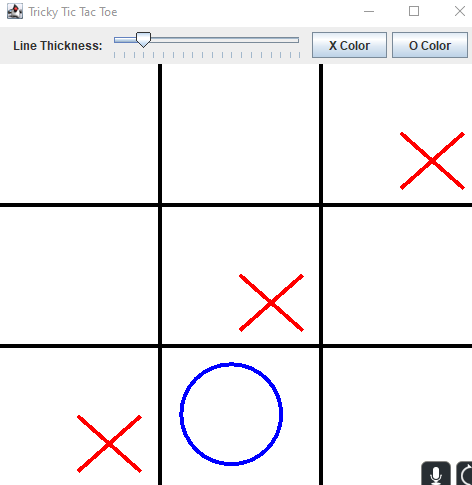

<div class="text-center p-4">
  
  
  
</div>

## **Overview** 

Tricky Tic-Tac-Toe is a game that I programmed for my ICS111 class. This is just like standard Tic-Tac-Toe but after each player's turn, there is a chance for a random square on the board to be cleared. The game is solely based off of RNG, having a 50% chance to remove a random space on the board completely makes the game uncontrollable. Creating such a game like this required a lot of different functions, along with knowing how to use the GUI that Java provides. Since it was one of the first programming courses, I had an extremely hard time using the GUI. When trying to draw lines or put things in the exact center, it was always a guessing game to myself. You can see that in the images, the two shapes are a tad bit off center due to myself having a hard time with the positioning. 

## **The Code Behind** 

In this project, we needed to creat a GUI to display the Tic-Tac-Toe board along with coding an AI that will automatically place a character based on where the player went. The AI was not perfect however, it did know when the player only needed one more space to win. The AI had to know whether the game was won, lost, could be won, could be lost, along with which spaces were available. A lot of helper methods were made especially since spaces were constantly being deleted and then filled.

These are three example methods that I used in to create this game. There was a lot of testing out arrays, along with using formulas to get the position values correct.

```cpp
boolean won(char player) {
            for (int i = 0; i < 8; ++i)
                if (testRow(player, rows[i][0], rows[i][1]))
                    return true;
            return false;
        }

        boolean testRow(char player, int a, int b) {
            return position[a] == player && position[b] == player
                    && position[(a + b) / 2] == player;
        }

        void nextMove() { //ai
            int r = findRow(X);
            if (r < 0)
                r = findRow(O);
            if (r < 0) {
                do
                    r = random.nextInt(9);
                while (position[r] != BLANK);
            }
            position[r] = X;
        }
```


