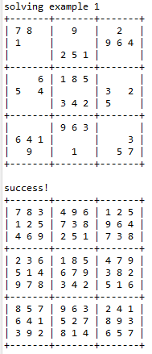

This sudoku solver is one of the assignments that we were given in ICS211. The only requirement was that we needed to use recursion to solve the board. We were also given a function called 'checkSudoku', which would check if the board was valid and followed all the game cases. When doing this project, I felt that it was pretty difficult as recursion is a very hard topic. Understanding how recursion calls work along with how to navigate the sudoku board were the key components to this project.

Here we can see some code from the 'fillSudoku' function:

```
 public static boolean fillSudoku (int [] [] sudoku)
  {
    if(!checkSudoku(sudoku, false)) { return false; }
    BitSet fixedVal = new BitSet(81); //9x9 board
    for(int i = 0; i < 9; i++) {
      for(int j = 0; j < 9; j++) {
        if(sudoku[i][j] != 0) {
          fixedVal.set(i*9+j);
        }
      }
    }
    int start = 0;
    while(fixedVal.get(start)) {
      start++;
    }
    if(start ==81) {
      return true;
    }
    return fillSudokuAt(sudoku, start, fixedVal);
  }

```

This part of the code was the initialization for the program. This would create a new sudoku board, then keep track of which spots were already full. It would then call the next recursively called function to fill out and guess the rest of the board. The recursively called funtion 'fillSudokuAt' would then guess values 1 through 9 for each spot until it guessed the value that satisfied all the sudoku conditions. 

Here is the code for the 'fillSudokuAt' function:

```
 private static boolean fillSudokuAt(int[][] sudoku, int position, BitSet fixedVal) {
    if(position == 81) { return checkSudoku(sudoku, false); }
    int i = position/9;
    int j = position % 9;
    position++;
    
    while(fixedVal.get(position)) {
      position++;
    }
    
    for(int guess = 1; guess < 10; guess++) {
      sudoku[i][j] = guess;
      
      if(checkSudoku(sudoku, false)) {
        if(fillSudokuAt(sudoku, position, fixedVal)) {
          return true;
        }
      }
      
    }
    sudoku[i][j] = 0;
    return false;
    
  }


```

